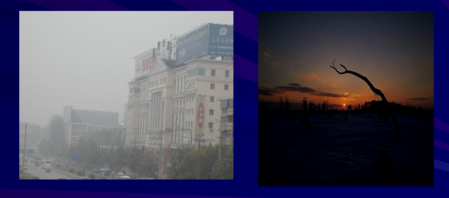

<head>
    <script src="https://cdn.mathjax.org/mathjax/latest/MathJax.js?config=TeX-AMS-MML_HTMLorMML" type="text/javascript"></script>
    <script type="text/x-mathjax-config">
        MathJax.Hub.Config({
            tex2jax: {
            skipTags: ['script', 'noscript', 'style', 'textarea', 'pre'],
            inlineMath: [['$','$']]
            }
        });
    </script>
</head>

**问题的引入**

看两个图例，分析画面效果不好的原因，亮暗差别不是很大

解决问题的思路:提高对比度，增加清晰度


**对比度的概念**

+ 对比度：通俗地讲，就是亮暗的对比程度。
+ 对比度通常表现了图像画质的清晰程度
+ 对比度的计算公式如下：
  
$$
C=\sum_{\delta} \delta(i, j)^{2} P_{\delta}(i, j)
$$
其中：$\delta(i, j)=|i-j|$ 即相邻像素间的灰度差,$P_{\delta}(i, j)$ 即相邻像素间的灰度差为δ的像素分布概率

**像素相邻：**


对比度的计算例子，设图像为：

$$
L=\left[ \begin{array}{llll}{1} & {3} & {9} & {9} \\ {2} & {1} & {3} & {7} \\ {3} & {6} & {0} & {6} \\ {6} & {8} & {2} &{0}\end{array}\right]
$$

$$
\begin{aligned} C_{L} &=\left[\left(1^{2}+2^{2}\right)+\left(2^{2}+6^{2}+2^{2}\right)+\left(6^{2}+0^{2}+6^{2}\right)+\left(0^{2}+2^{2}\right)\right.\\ &+\left(1^{2}+1^{2}+1^{2}\right)+\left(1^{2}+2^{2}+2^{2}+5^{2}\right)+\left(2^{2}+4^{2}+6^{2}+3^{2}\right)+\left(4^{2}+2^{2}+1^{2}\right) \\ &+\left(1^{2}+3^{2}+3^{2}\right)+\left(3^{2}+6^{2}+5^{2}+2^{2}\right)+\left(6^{2}+6^{2}+3^{2}+2^{2}\right)+\left(6^{2}+1^{2}+6^{2}\right) \\ &+\left(3^{2}+2^{2}\right)+\left(2^{2}+6^{2}+2^{2}\right)+\left(6^{2}+2^{2}+2^{2}\right)+\left(2^{2}+6^{2}\right) ] / 48 \\ &=16.6818 \end{aligned}
$$

--------------

## 图像增强
图像增强的目的是为了改善画质，使图像的显示效果更加清晰。

### 线性对比度展宽

+ 对比度展宽的目的是：通过将亮暗差异（即对比度）扩大，来把人所关心的部分强调出来。
+ 原理是，进行像素点对点的，灰度级的线性影射。该影射关系通过调整参数，来实现对亮暗差异的扩大。

**具体为：**
+ 设原图、处理后的结果图的灰度值分别为$f(i,j)$和$g(i,j)$;
+ 要求$f(i,j)$和$g(i,j)$均在[0，255]间变化，但是g的表现效果要优于f。
+ 因为f和g的取值范围相同，所以通过**抑制**不重要的部分，来**扩展**所关心部分的对比度。

为了达到上面所提出的目的，原图（横轴上的f(i,j)）与处理后图（纵轴上的g(i,j)）的灰度影射关系可用下图表示。


将上面图示的影射关系，用计算公式表达即为：

$$
g(i, j)=\left\{\begin{array}{ll}{\alpha f(i, j)} & {0 \leq f(i, j)<a} \\ {\beta(f(i, j)-a)+g_{a}} & {a \leq f(i, j)<b} \\ {\gamma(f(i, j)-b)+g_{b}} & {b \leq f(i, j)<255}\end{array}\right.
$$

$$(i=1,2, \ldots, m ; \quad j=1,2, \dots, n)$$

**灰级窗**

+ 当256个灰度级所表示的亮暗范围内的信息量太大，没办法很好地表述时，通过开窗的方式，每次只把窗内的灰度级展宽，而把窗外的灰度级完全抑制掉。
  
---------------------
### 动态范围调整

+ 动态范围：是指图像中所记录的场景中从暗到亮的变化范围。
+ 动态范围对人视觉的影响：由于人眼所可以分辨的灰度的变化范围是有限的，所以当动态范围太大时，很高的亮度值把暗区的信号都掩盖了。

动态范围调整思路：通过**动态范围的压缩**可以将所关心部分的灰度级的变化范围**扩大**。

**动态范围调整方法分为以下两种：**
1. 线性动态范围调整
2. 非线性动态范围调整

**线性动态范围调整**
+ 通过把原图中"**不太黑**"的像素也变成黑，把原图中“不太白”的相素也变成白的方式，来压缩动态范围，使新的图像中，关心部分的对比度可以展宽。
+ 如下图所示，将原来[0,255]范围内的亮暗变化，压缩到[a,b]范围内。

按照上面的设计思路，可以得到新图与原图的对应关系如下。可以看到，线性动态范围调整的影射关系与灰级窗的相同。


**例题**


**非线性动态范围调整**
+ 提出非线性动态范围调整，是因为线性动态范围调整的分段线性影射不够光滑。
+ 非线性动态范围调整，要求可以用光滑的曲线来实现。
+ 考虑到人眼对视觉信号的处理过程中，有一个近似对数算子的环节，因此，可采用对数运算来实现非线性动态范围调整。

设原图为f$(i,j)$，处理后的图像为$g(i,j)$，则映射关系为：
$$
g(i, j)=c \log _{10}(1+f(i, j))
$$


------------
### 直方图均衡化

+ 直方图均衡化方法的基本思想是，对在图像中**像素个数多的灰度级进行展宽**，而对**像素个数少的灰度级进行缩减**。从而达到清晰图像的目的。
+ 因为灰度分布可在直方图中描述，所以该图像增强方法是基于图像的灰度直方图。

**直方图均衡化方法实现**

**1.求直方图**

设$f、g$分别为原图像和处理后的图像。求出原图$f$的灰度直方图，设为$h$。显然，在[0,255]范围内量化时，$h$是一个256维的向量。


**2.计算原图的灰度分布概率**
1. 求出图像f的总体像素个数 $Nf = m*n$ (m,n分别为图像的长和宽）
2. 计算每个灰度级的分布概率，即每个像素在整个图像中所占的比例。$hs(i)=h(i)/Nf  (i=0,1,…,255)$


**3.计算原图灰度的累计分布**
+ 设图像各灰度级的累计分布hp
$$
\begin{array}{r}{h_{p}(i)=\sum_{k=0}^{i} h_{s}(k)} \\ {i=0,1,2, \ldots, 255}\end{array}
$$


**4.计算原、新图灰度值的影射关系**
+ 新图像g的灰度值$g(i,j)$为
$$
g(i, j)=\left\{\begin{array}{cc}{255 \cdot h p(k)} & {f(i, j) \neq 0} \\ {0} & {f(i, j)=0}\end{array}\right.
$$
$h_{p}(k) : f(i, j)(f(i, j) \neq 0)$的累计概率分布，$f(i, j)$为原始图像上面的像素值


**5. 原、新图灰度直方图比较**


## opencv里面的直方图均衡化

**直方图均衡，并用它来改善图像的对比度。**

# 画出直方图和像素分布情况
```
import cv2
import numpy as np
from matplotlib import pyplot as plt
img = cv2.imread('wiki.jpg')
hist,bins = np.histogram(img.flatten(),256,[0,256])

cdf = hist.cumsum()
cdf_normalized = cdf * hist.max()/ cdf.max()

plt.plot(cdf_normalized, color = 'b')
plt.hist(img.flatten(),256,[0,256], color = 'r')
plt.xlim([0,256])
plt.legend(('cdf','histogram'), loc = 'upper left')
plt.show()
```


画出原始图：

`plt.imshow(img)`


**直方图均衡化**

函数`cv2.equalizeHist()`它的输入只是灰度图像，输出是我们的直方图均衡图像。
```
img = cv2.imread('wiki.jpg',0)
equ = cv2.equalizeHist(img)
res = np.hstack((img,equ)) #stacking images side-by-side
cv2.imwrite('res.png',res)
```
均衡化后的效果


